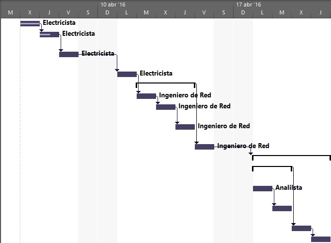

# Práctica 1. Aportes de project a la Dirección de Proyectos

## Objetivo de la práctica:
Al finalizar la práctica, será capaz de:

- Cambiar la vista.
- Visualizar el reporte de costos.
- Localizar el menú que contiene los Reportes Visuales.
- Mostrar la hoja de recursos.
- Visualizar y ocultar la vista de línea de tiempo.

## Objetivo Visual 

## Duración aproximada:
- 20 minutos.

## Datos de Acceso:
Se envía la IP, usuario y credencial para el acceso al escritorio remoto.

## Instrucciones 
<!-- Proporciona pasos detallados sobre cómo configurar y administrar sistemas, implementar soluciones de software, realizar pruebas de seguridad, o cualquier otro escenario práctico relevante para el campo de la tecnología de la información -->
### Tarea 1. Abra el archivo de Project titulado “Ejercicio módulo 1” y realice las siguientes actividades:
1.	Cambiar la vista de Gantt a la Vista de Gantt de Seguimiento.
2.	¿En qué menú se encuentra la opción para visualizar el reporte de costos?
3.	¿En qué menú se encuentran los Reportes Visuales?
4.	Mostrar la hoja de recurso.
5.	Visualizar y después ocultar la vista de línea de tiempo.

### Resultado esperado

