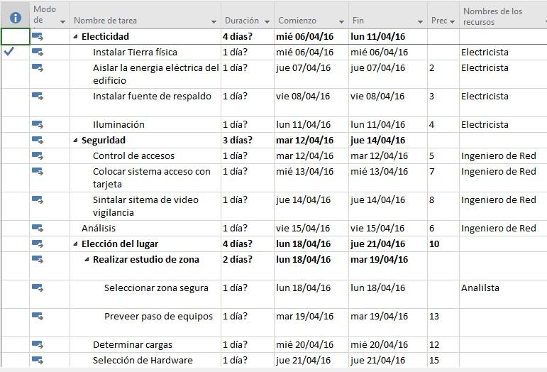

# Nombre del laboratorio 

## Objetivo de la práctica:
Al finalizar la práctica, serás capaz de:

- Cambiar la vista: Aprender a cambiar de la Vista de Gantt a la Vista de Gantt de Seguimiento.
- Reportes de costos: Identificar el menú donde se encuentra la opción para visualizar el reporte de costos.
- Reportes visuales: Localizar el menú que contiene los Reportes Visuales.
- Hoja de recursos: Mostrar la hoja de recursos para gestionar la asignación de tareas.
- Vista de línea de tiempo: Visualizar y ocultar la vista de línea de tiempo según las necesidades del proyecto.

## Objetivo Visual 
Crear un diagrama o imagen que resuma las actividades a realizar, un ejemplo es la siguiente imagen. 

## Duración aproximada:
- xx minutos.

## Tabla de ayuda:
Agregar una tabla con la información que pueda requerir el participante durante el laboratorio, como versión de software, IPs de servers, usuarios y credenciales de acceso.
| Contraseña | Correo | Código |
| --- | --- | ---|
| Netec2024 | edgardo@netec.com | 123abc |

## Instrucciones 
<!-- Proporciona pasos detallados sobre cómo configurar y administrar sistemas, implementar soluciones de software, realizar pruebas de seguridad, o cualquier otro escenario práctico relevante para el campo de la tecnología de la información -->
### Tarea 1. Descripción de la tarea a realizar.
Paso 1. Debe de relatar el instructor en verbo infinito, claro y conciso cada actividad para ir construyendo paso a paso en el objetivo de la tarea.

Paso 2. <!-- Añadir instrucción -->

Paso 3. <!-- Añadir instrucción -->

### Tarea 2. Descripción de la tarea a realizar.
Paso 1. Debe de relatar el instructor en verbo infinito, claro y conciso cada actividad para ir construyendo paso a paso en el objetivo de la tarea.

Paso 2. <!-- Añadir instrucción -->

Paso 3. <!-- Añadir instrucción -->

### Resultado esperado
En esta sección, se debe mostrar el resultado esperado de nuestro laboratorio

