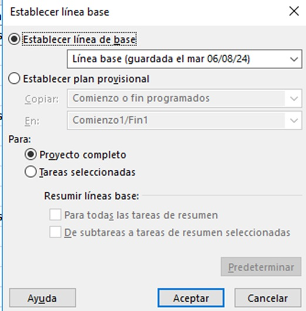
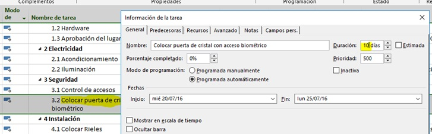

# Práctica 10. Cronograma final 

## Objetivo de la práctica:
Al finalizar la práctica, será capaz de:
- Revisar estadísticas.
- Grabar la línea base.
- Comparar estadísticas.
- Configurar dependencias.
- Revisar tabla de costos, tabla de variación y tabla de trabajo.

## Objetivo Visual 

## Duración aproximada:
- 50 minutos.

## Datos de Acceso:
Se envía la IP, usuario y credencial para el acceso al escritorio remoto.

## Instrucciones 

### Tarea 1. Abra el archivo de Project titulado “Ejercicio Modulo 10” y realice las siguientes actividades:
1.	Abrir las estadísticas y apuntar los datos que muestra esta ventana.
2.	Grabar la línea base de este cronograma.
3.	Abrir las estadísticas y apuntar los datos que cambiaron.
4.	Agregar la actividad “Colocar puerta de cristal con acceso biométrico” debajo de la tarea “Control de accesos”.
5.	La duración de esta tarea será de 10 días.
6.	Esta actividad debe ser sucesora de la tarea “Control de accesos” y predecesora de la tarea “Colocar rieles”. Hacer las modificaciones necesarias.
7.	Abrir las estadísticas y apuntar otra vez los datos mostrados.
8.	La tarea “Colocar puerta de cristal con acceso biométrico” será responsabilidad de Ernesto Larrea, necesita una puerta de cristal con un costo de $2,000.00 y el sistema biométrico con un costo de $4,000.00 Agregar los recursos a la tarea.
9.	Abrir la tabla “Costos” y anotar el costo total de la tarea agregada.
10.	Abrir la tabla “Variación” y anotar la variación.
11.	Abrir la tabla “Trabajo” y anotar la variación.
12.	Inactivar la tarea: 5.3 Manual.

### Resultado esperado

