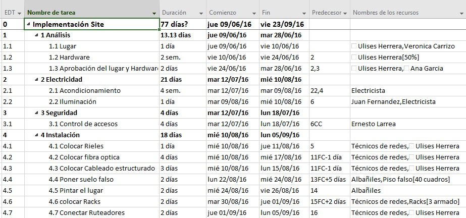
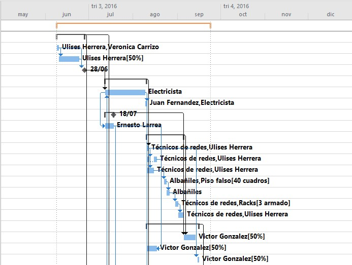

# Práctica 11a. Informes e impresiones

## Objetivo de la práctica:
Al finalizar la práctica, será capaz de:
- Mostrar escala de tiempo.
- Crear líneas de tiempo.
- Modificar formato del diagrama de Gantt.
- Generar reporte de costos y reporte de recursos.
- Resaltar tareas críticas.

## Objetivo Visual 

## Duración aproximada:
- 30 minutos.

## Datos de Acceso:
Se envía la IP, usuario y credencial para el acceso al escritorio remoto.

## Instrucciones 
<!-- Proporciona pasos detallados sobre cómo configurar y administrar sistemas, implementar soluciones de software, realizar pruebas de seguridad, o cualquier otro escenario práctico relevante para el campo de la tecnología de la información -->
### Tarea. Abra el archivo de Project titulado “Ejercicio Modulo 11” y realice las siguientes actividades:
1.	Muestre la Escala de tiempo y ponga en la misma las tareas agrupadoras
2.	Cree una línea de tiempo general y una para cada tarea agrupadora
3.	Modifique el formato de la barra del diagrama de Gantt, debe mostrar la barra en color verde y del lado derecho la fecha fin de cada tarea y en medio de la barra el nombre del recurso asignado
4.	Elabore un reporte de costos en Excel
5.	Elabore un reporte de Recursos en el menú reportes
6.	Haga un filtro por fecha de terminación
7.	Resalte las tareas críticas
8.	Cree una nueva columna llamada “Personal”
9.	Esta columna tendrá dos tipos de personal: “De confianza” y “Sindicalizado”
10.	Muestre la columna “Personal”
11.	Todos los recursos genéricos son personal sindicalizado, todos los recursos no genéricos son personal de Confianza, llene con estos datos la columna “Personal”
12.	Cree un nuevo criterio de agrupación con la columna “Personal”
13.	Muestre el grupo “Personal”

### Resultado esperado

# Práctica 11b. Múltiples proyectos

## Objetivo de la práctica:
Al finalizar la práctica, será capaz de:
- Crear archivo maestro.
- Vincular recursos compartidos.
- Mostrar proyecto vinculado.

## Objetivo Visual 

## Duración aproximada:
- 50 minutos.

## Datos de Acceso:
Se envía la IP, usuario y credencial para el acceso al escritorio remoto.

## Instrucciones 
<!-- Proporciona pasos detallados sobre cómo configurar y administrar sistemas, implementar soluciones de software, realizar pruebas de seguridad, o cualquier otro escenario práctico relevante para el campo de la tecnología de la información -->
### Tarea. Abra el archivo de Project titulado “Ejercicio Modulo 12. Implementación site” e inserte el subproyecto “Ejercicio Modulo 12. Inauguración", a continuación realice las siguientes actividades:
1.	Cree un archivo maestro 
2.	Use la opción de recursos compartidos para vincular los dos proyectos
3.	Abra el archivo que eligió como base
4.	Muestre el proyecto vinculado con los recursos compartidos
5.	Vincule las tareas de análisis y planeación
6.	Actualice las tareas de análisis y planeación al 100% de avance en el documento maestro y observe como se modifican en el archivo “Ejercicio Modulo 12. Inauguración”

### Resultado esperado

