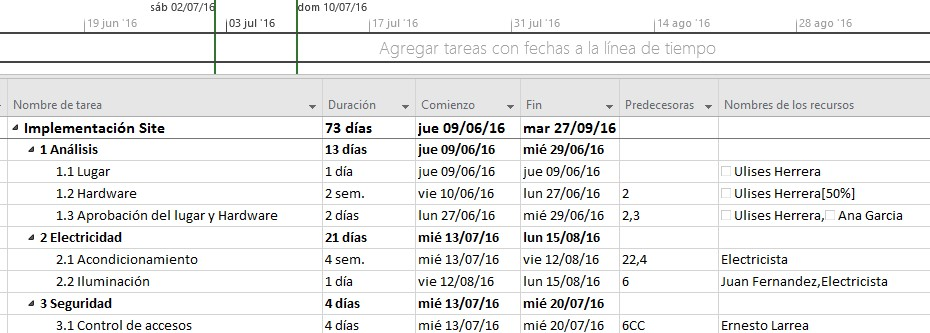
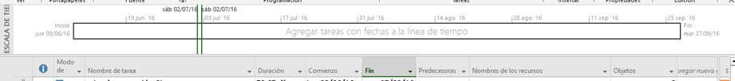

# Práctica 11. Informes e impresiones 

## Objetivo de la práctica:
Al finalizar la práctica, será capaz de:
- Mostrar escalas de tiempo.
- Crear líneas de tiempo.
- Modificar el formato del diagrama de Gantt.
- Generar reporte de costos y reporte de recursos.
- Resaltar tareas críticas.

## Objetivo Visual 

## Duración aproximada:
- 30 minutos.

## Datos de Acceso:
Se envía la IP, usuario y credencial para el acceso al escritorio remoto.

## Instrucciones 

### Tarea 1. Abrir el archivo de Project titulado “Ejercicio Modulo 11” y realizar las siguientes actividades:
1.	Mostrar la Escala de tiempo y poner en la misma las tareas agrupadoras.
2.	Crear una línea de tiempo general y una para cada tarea agrupadora.
3.	Modificar el formato de la barra del diagrama de Gantt, debe mostrar la barra en color verde, del lado derecho la fecha fin de cada tarea y en medio de la barra el nombre del recurso asignado.
4.	Elaborar un reporte de costos en Excel.
5.	Elaborar un reporte de Recursos en el menú reportes.
6.	Hacer un filtro por fecha de terminación.
7.	Resaltar las tareas críticas.
8.	Crear una nueva columna llamada “Personal”.
9.	Esta columna tendrá dos tipos de personal: “De confianza” y “Sindicalizado”.
10.	Muestre la columna “Personal”.
11.	Todos los recursos genéricos son personal sindicalizado, todos los recursos no genéricos son personal de Confianza, llenar con estos datos la columna “Personal”.
12.	Crear un nuevo criterio de agrupación con la columna “Personal”.
13.	Mostra el grupo “Personal”.

### Resultado esperado

