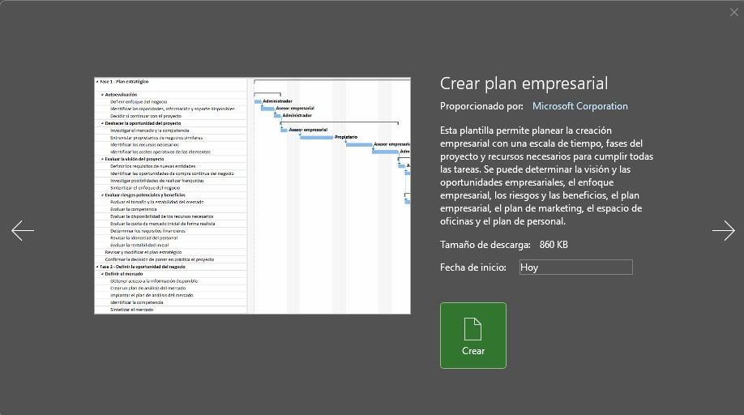
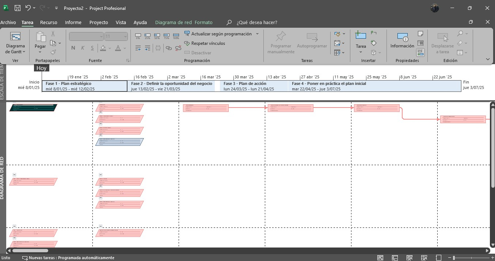

# Práctica 12. Novedades en Project 2024

## Objetivo de la práctica:
Al finalizar la práctica, será capaz de:
- Usar y personalizar una plantilla.

## Objetivo Visual 

## Duración aproximada:
- 30 minutos.

## Datos de Acceso:
Se envía la IP, usuario y credencial para el acceso al escritorio remoto.

## Instrucciones 
<!-- Proporciona pasos detallados sobre cómo configurar y administrar sistemas, implementar soluciones de software, realizar pruebas de seguridad, o cualquier otro escenario práctico relevante para el campo de la tecnología de la información -->
### Tarea. Abra Project y a continuación realice las siguientes actividades:
1.	Cree un archivo a partir de la plantilla "Crear plan empresarial"
2.	Modifique, elimine o adicione las tares que considere relevantes
3.	En la hoja de recursos establezca los valores que considere pertinentes
4.	Identifique la ruta critica luego de las personalizaciones realizadas

### Resultado esperado

