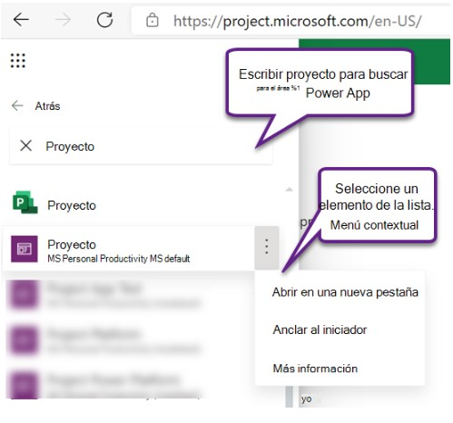
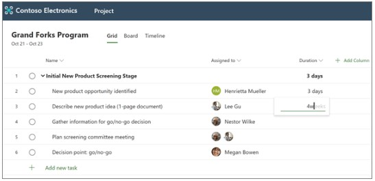

# Práctica 13. Project para la web 

## Objetivo de la práctica:
Al finalizar la práctica, será capaz de:
- Abrir y crear un nuevo proyecto.
- Anclar proyectos.
- Desanclar proyectos.
- Agregar tareas y tareas de Resumen.
- Asignar tareas.
- Agregar duración y columnas.

## Objetivo Visual 

## Duración aproximada:
- 80 minutos.

## Datos de Acceso:
Se envía la IP, usuario y credencial para el acceso al escritorio remoto y la cuenta de Microsoft 365.

## Instrucciones 

### Tarea 1. Abrir un proyecto.
1. En Inicio de Project, seleccionar el iniciador de aplicaciones (el cuadrado de puntos que hay en la parte superior izquierda de la página) y, después, seleccionar Todas las aplicaciones. 
2. Cerca de la parte superior, seleccionar Buscar todas las aplicaciones, escribir Project y después buscar la aplicación de Project Office en los resultados (tiene el icono de "P" de color blanco sobre verde). La aplicación que aparece justo debajo (con un icono de color púrpura) es Project Power App.
3. Seleccionar Project Power App para abrirla, o bien seleccionar su menú contextual y elegir una acción. Si tiene previsto abrir la aplicación con frecuencia, es una buena idea elegir Anclar al iniciador.
4. Al abrir la aplicación, en la pestaña Proyectos, asegurarse de seleccionar la vista del sistema adecuada: la vista predeterminada es Mis proyectos activos, donde se muestra una lista de los proyectos que ha creado y que están en curso. Para abrir un proyecto de otra persona al que tenga acceso, seleccione la vista Todos los proyectos.
5. Al ver el proyecto en la lista, seleccionar su nombre para abrirlo.

### Tarea 2. Crear un nuevo proyecto.
1. Cerca de la parte superior izquierda de la aplicación, seleccionar Nuevo proyecto.
2. Rellenar los campos obligatorios en la pestaña General, luego realizar una de las siguientes acciones:
- Seleccionar Guardar si quiere agregar tareas o cambiar otros detalles del nuevo proyecto antes de cerrarlo.
- Seleccionar Guardar y cerrar para cerrar ahora y volver más tarde para rellenar los detalles del proyecto.

### Tarea 3. Anclar un proyecto de la lista de Recientes.
1. En la lista Recientes de Project Power App, se muestran siempre los proyectos más recientes que haya abierto en la herramienta. Para tener un proyecto a mano incluso si no aparece en una de las vistas, puede anclar los proyectos si aparecen en la lista de Recientes. Los elementos anclados aparecen en la lista Anclados, que está justo debajo de la lista de Recientes.
2. En la parte izquierda, sobre las pestañas, seleccionar Mapa del sitio para expandir el panel izquierdo (puede omitir este paso si ya está expandido).
3. En el panel izquierdo, seleccionar Recientes y, después, seleccionar el icono de chincheta junto al proyecto que quiera anclar.
4. El proyecto aparece ahora en Anclados y el icono de chincheta junto a él en la lista de Recientes, cambia. Selecciónar nuevamente para desanclar el elemento.

### Tarea 4. Desanclar un proyecto de la lista Anclados .
1. En la parte izquierda, sobre las pestañas, seleccionar Mapa del sitio para expandir el panel izquierdo (puede omitir este paso si ya está expandido).
2. En el panel izquierdo, seleccionar Anclados y seleccionar el icono a la izquierda del proyecto anclado.
3. El proyecto desaparece de la lista de Anclados. Aún puede examinar el proyecto, buscarlo o abrirlo desde cualquier vista que lo muestre.

### Tarea 5. Agregar tareas y tareas de Resumen.
1. Seleccionar Agregar nueva tarea y escribir un nombre de tarea. Luego, presione Entrar.
2. Escribir otro nombre de tarea y presionar entrar de nuevo hasta que tenga una lista completa de tareas.
3. Para aplicar sangría a las tareas, en tareas de Resumen, seleccionar los tres puntos verticales que se hallan por el nombre de la tarea y elegir crear subtarea.
- Sugerencias:
- Para seleccionar más de una tarea, seleccione una tarea, mantenga presionada la tecla Ctrl y, a continuación, seleccione otra tarea.
- También puede elegir promover subtarea para desplazar tareas desde tareas de resumen.

### Tarea 6. Asignar tareas
1. Para asignar tareas, el proyecto debe asociarse con un grupo de Office 365. Si es el propietario del proyecto, puede:
- Agregar el proyecto a un grupo seleccionando de miembros del grupo en la parte superior del proyecto.
- Agregar o quitar personas del grupo del proyecto.
2. Para asignar una tarea:
- En la columna asignada de una tarea, seleccionar el icono de la persona.
- Elegir un miembro del equipo de la lista o escribir el texto para buscar uno.

### Tarea 7. Agregar duración y columnas
A menudo es más fácil empezar a construir el proyecto con la duración.
1. En la columna duración de una tarea, escribir el número de días que crea que tendrá que hacer.
- Si desea usar una unidad de tiempo diferente, escribir un número más la palabra horas, semanas o meses.
- Si desea que la tarea aparezca como un hito en la vista escala de tiempo, escribir 0 días en la columna duración.
2. Presionar entrar para ir al campo duración de la tarea siguiente y continuar especificando duraciones.
- Nota: No se puede especificar la duración de las tareas de resumen.
- Puede continuar agregando más detalles al proyecto agregando columnas. Junto a encabezado de columna duración, elegir Agregar columna.
  
### Resultado esperado

