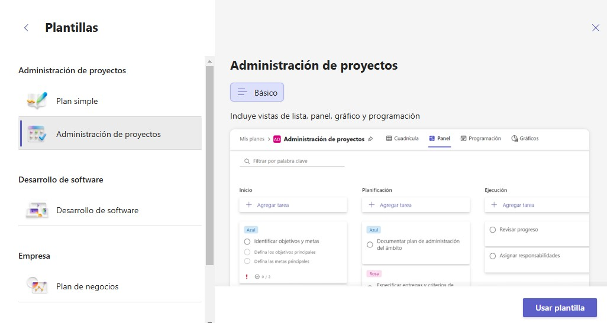
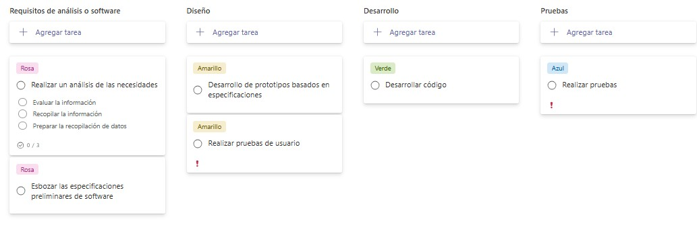

# Ejercicio Capítulo 13

## Objetivo de la práctica:
Al finalizar la práctica, será capaz de:
- Crear un plan nuevo.
- Trabajar con Cubos.
- Trabajar con etiquetas
- Realizar seguimiento de tareas.
- Mover una tarea.
- Ver la disponibilidad de todos los usuarios y asignar tareas.
- Ver el estado de todos los usuarios.
- Cerrar una tarea.

## Objetivo Visual 

## Duración aproximada:
- 80 minutos.

## Datos de Acceso:
Se envía la IP, usuario y credencial para el acceso al escritorio remoto y la cuenta de Microsoft 365.

## Instrucciones 
<!-- Proporciona pasos detallados sobre cómo configurar y administrar sistemas, implementar soluciones de software, realizar pruebas de seguridad, o cualquier otro escenario práctico relevante para el campo de la tecnología de la información -->
### Tarea 1. Crear un plan nuevo.
1. Seleccione Nuevo plan en el panel de navegación izquierdo.
2. Asigne un nombre al plan y elija si desea anclarlo al panel de navegación izquierdo. También puede elegir compartir su plan si lo agrega a un grupo. Tenga en cuenta que puede compartir su plan en cualquier momento.
3. Seleccione Crear plan.

### Tarea 2. Trabajar con Cubos.
1. Seleccione Agregar nuevo cubo y escriba una nueva categoría de tarea.
2. Seleccione + para agregar tareas a un cubo y, después, escriba un nombre.
3. Por último, seleccione Agregar tarea.

### Tarea 3. Trabajar con etiquetas.
1. Escriba los nombres de las etiquetas.
2. Seleccione un cuadro de color para quitar o agregar una etiqueta a una tarea.

### Tarea 4. Realizar seguimiento de tareas.
1. Seleccione Gráficos > Agrupar por > Fecha de vencimiento para ver qué tareas van a vencer.
2. Seleccione Panel > Agrupar por > Progreso para ordenar las tareas según su evolución.

### Tarea 5. Mover una tarea.
Al asignar una prioridad a los cubos, puede mover las tareas de un cubo a otro en función de su urgencia.
1. Seleccione una tarea cuya prioridad quiera cambiar y, después, muévala al cubo que quiera.

### Tarea 6. Ver la disponibilidad de todos los usuarios y asignar tareas.
Busque a un miembro del equipo y, a continuación, asígnele una tarea.
1. Seleccione Gráficos.
2. En el panel Miembros, busque el miembro del equipo que tenga menos tareas asignadas.
3. Seleccione Agrupar por > Asignadas a para que las tareas Sin asignar aparezcan primero en la lista.
4. Después, seleccione Miembros y arrastre a la tarea el miembro del equipo que haya elegido para crear la asignación.

### Tarea 7. Ver el estado de todos los usuarios.
Consulte todas las tareas en la vista Panel para ver la evolución de todos los usuarios y calcular el trabajo que tiene cada uno.
1. Seleccione Panel > Agrupar por > Asignadas a.
2. En la vista Asignadas a, puede hacer lo siguiente:
- Ver el nombre del cubo en el nombre de tarea para organizar el trabajo en función de su prioridad.
- Arrastrar y colocar las tareas para cambiar la persona a la que se han asignado.

### Tarea 8. Cerrar una tarea
Cuando haya terminado con una tarea, ciérrela para marcarla como completada.
1. Seleccione Completar tarea cuando haya terminado con una tarea y quiera cerrarla.

### Resultado esperado

