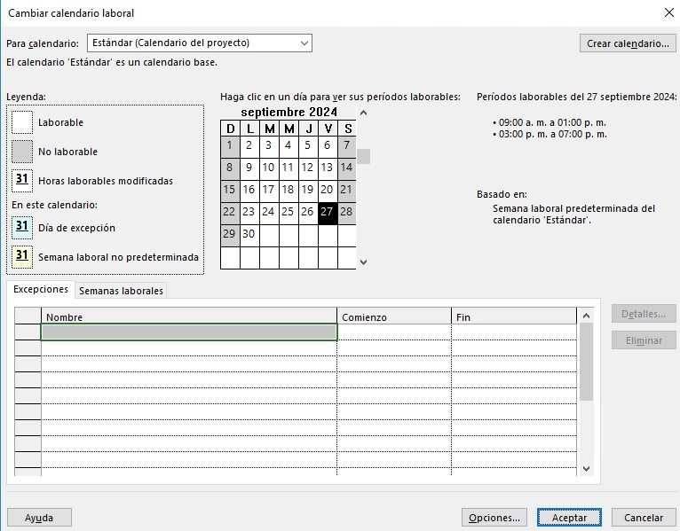

# Práctica 2. Introducción a Project 2019

## Objetivo de la práctica:
Al finalizar la práctica, será capaz de:
- Crear un nuevo archivo.
- Modificar el calendario del proyecto.
- Agregar días festivos.
- Cambiar el horario laboral.
- Crear un nuevo calendario.

## Objetivo Visual 

## Duración aproximada:
- 30 minutos.

## Datos de Acceso:
Se envía la IP, usuario y credencial para el acceso al escritorio remoto.

## Instrucciones 
### Tarea 1. Abrir el archivo de Project titulado  "Ejercicio modulo 2. Instalación Site calendarios" y realizar las siguientes actividades:
1.	Ir al calendario estándar y seleccionar la opción cambiar el tiempo del proyecto.
2.	Introducir los siguientes días festivos al calendario: Navidad,	Año nuevo, Día de la independencia y Día de la madre.	Si estos días festivos coinciden con días no laborables, programarlos al siguiente día laborable.
4.	Cambiar el horario de trabajo del Calendario Estándar con el horario de 8:00 a 18:00 horas con comida de 13:00 a 14:00 horas.
5.	Crear un nuevo calendario que sea copia del calendario base, en el cual los días laborables sean de miércoles a domingo, llamar a este calendario “Calendario de instalación”.
6.	Modificar la fecha de inicio del proyecto para que comience en el primer lunes del siguiente mes.

### Resultado esperado

