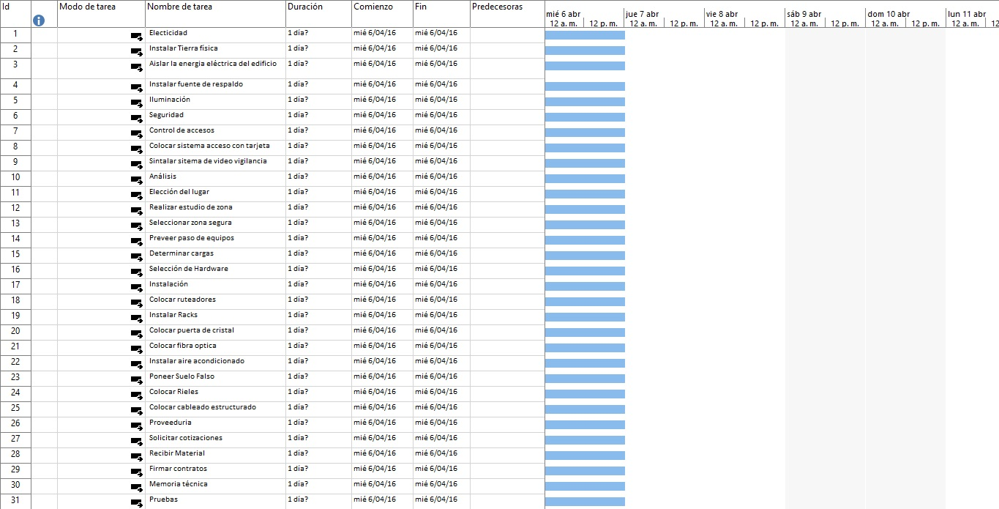

# Práctica 3. Crear un nuevo proyecto

## Objetivo de la práctica:
Al finalizar la práctica, será capaz de:
- Configurar todas las tareas existentes en modo automático.
- Agregar una nueva tarea.
- Configurar tareas automáticas.
- Cambiar el modo de la nueva tarea de manual a automático.

## Objetivo Visual 

## Duración aproximada:
- 30 minutos.

## Datos de Acceso:
Se envía la IP, usuario y credencial para el acceso al escritorio remoto.

## Instrucciones 
### Tarea 1. Abrir el archivo de Project titulado “Ejercicio modulo 3. Modo manual y modo automatico” y realizar las siguientes actividades:
1.	Cambiar las tareas a modo automático.
2.	Agregar una nueva tarea.
3.	Cambiar las opciones del archivo para que las nuevas tareas sean automáticas.
4.	Cambiar el modo manual de la nueva tarea a modo automático.

### Resultado esperado

