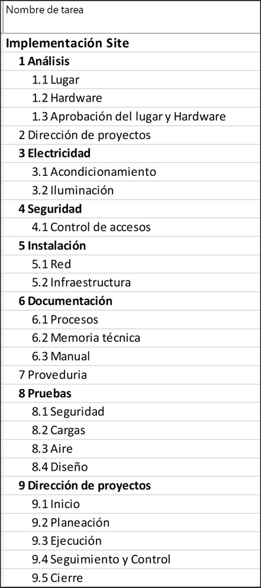

# Práctica 4. Creación de la EDT

## Objetivo de la práctica:
Al finalizar la práctica, será capaz de:
- Agrupar tareas.
- Mostrar tarea resumen.
- Agregar una nota.
- Programar una reunión recurrente.
  
## Objetivo Visual 

## Duración aproximada:
- 30 minutos.

## Datos de Acceso:
Se envía la IP, usuario y credencial para el acceso al escritorio remoto.

## Instrucciones 
### Tarea 1. Abra el archivo de Project titulado “Ejercicio modulo 4. Crear EDT” y realice las siguientes actividades:
1.	Este archivo tiene tareas que no están agrupadas en familia, configurar el Archivo para que se vea similar a la imagen del resultado deseado.
2.	Debe mostrar las sangrías, los números de esquema y el nombre de la tarea resumen del proyecto.
3.	Agregar una nota en la tarea 2 en la que se indique: “Evitar estar expuestos al peligro por sismos, contaminación, incendios, explosión, inundación, radiaciones e interferencia de radar”.
4.	Agregar una reunión semanal de avance de las tareas con duración de una hora, que se lleve a cabo todos los jueves y termine después de 10 repeticiones.

### Resultado esperado

