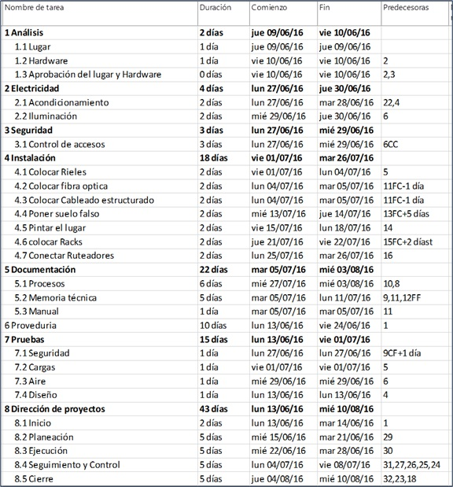

# Práctica 5. Relación de Dependencias

## Objetivo de la práctica:
Al finalizar la práctica, será capaz de:
- Secuenciar tareas.
- Mostrar la vista de Diagrama de Red tras secuenciar las tareas.
- Ocultar tareas agrupadoras.
- Reposicionar tareas.
- Crear una plantilla para tareas críticas.

## Objetivo Visual 

## Duración aproximada:
- 40 minutos.

## Datos de Acceso:
Se envía la IP, usuario y credencial para el acceso al escritorio remoto.

## Instrucciones 
### Tarea 1. Abrir el archivo de Project titulado “Ejercicio Modulo 5” y realizar las siguientes actividades:
1.	Este archivo tiene tareas que no tienen una secuencia.
2.	Agregar la secuencia en el archivo, usar varios métodos para ingresar esta información.
3.	Una vez terminada la secuenciación de las tareas, desplegar la vista de Diagrama de Red.
4.	Configurar su vista para que las tareas agrupadoras y la tarea resumen del proyecto no sea visible.
5.	Reposicionar la tarea 26 para que se muestre arriba de la tarea 9 dentro del diagrama de red.
6.	Crear una plantilla para las tareas críticas que tenga los siguientes datos: ID, Nombre, Comienzo, Fin, Duración, % Completado y Costo.

### Resultado esperado

