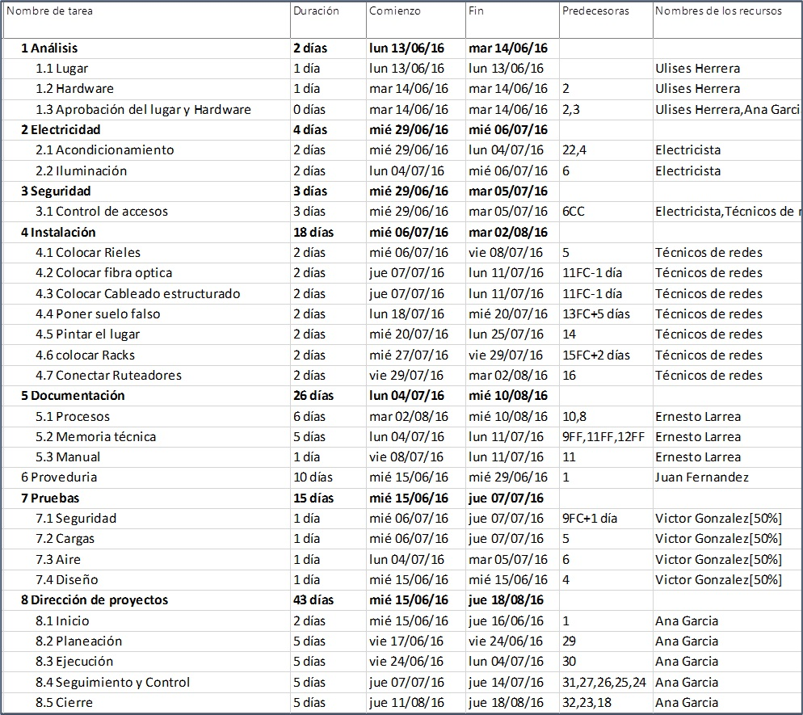

# Ejercicio Capítulo 6

## Objetivo de la práctica:
Al finalizar la práctica, será capaz de:
- Agregar recursos.
- Asignar recursos.

## Objetivo Visual 

## Duración aproximada:
- 40 minutos.

## Datos de Acceso:
Se envía la IP, usuario y credencial para el acceso al escritorio remoto.

## Instrucciones 
<!-- Proporciona pasos detallados sobre cómo configurar y administrar sistemas, implementar soluciones de software, realizar pruebas de seguridad, o cualquier otro escenario práctico relevante para el campo de la tecnología de la información -->
### Tarea. Abra el archivo de Project titulado “Ejercicio Modulo 6” y realice las siguientes actividades:
1.	Agregue los siguientes recursos con la información proporcionada en el objeto visual
2.	Asígnelos de acuerdo a la imagen del resultado esperado

### Resultado esperado

