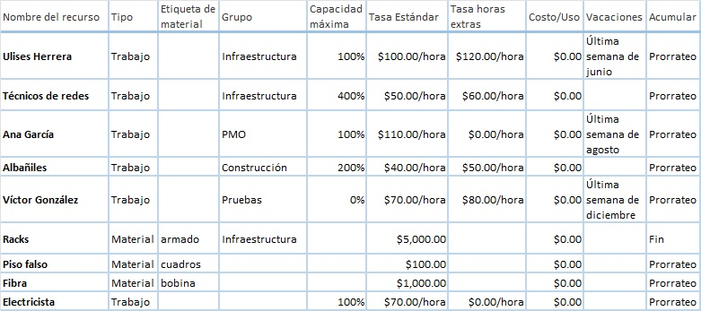

# Práctica 6. Recursos del Proyecto

## Objetivo de la práctica:
Al finalizar la práctica, será capaz de:
- Agregar recursos.
- Asignar recursos.

## Objetivo Visual 

## Duración aproximada:
- 40 minutos.

## Datos de Acceso:
Se envía la IP, usuario y credencial para el acceso al escritorio remoto.

## Instrucciones 
### Tarea 1. Abrir el archivo de Project titulado “Ejercicio Modulo 6” y realizar las siguientes actividades:
1.	Agregar los siguientes recursos con la información proporcionada en el objeto visual.
2.	Asígnar de acuerdo a la imagen del resultado esperado.

### Resultado esperado

