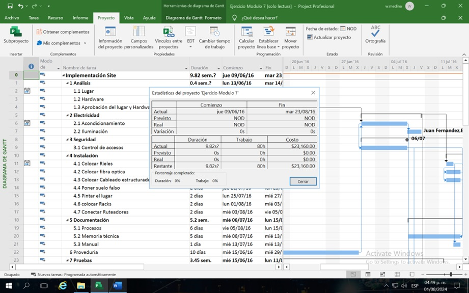
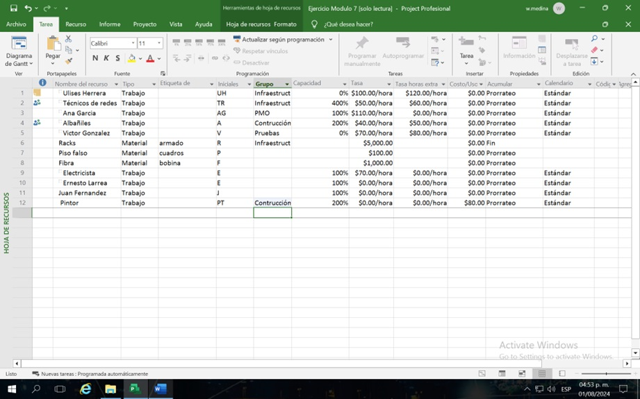

# Práctica. 7 Estimaciones de los paquetes de trabajo

## Objetivo de la práctica:
Al finalizar la práctica, será capaz de:
- Registrar duración y costo inicial.
- Agregar recurso genérico.
- Registrar duración y costo actualizado.
- Agregar recurso de material.
- Asignar horas de esfuerzo.
- Registrar duración y costo final.

## Objetivo Visual 

## Duración aproximada:
- 40 minutos.

## Datos de Acceso:
Se envía la IP, usuario y credencial para el acceso al escritorio remoto.

## Instrucciones 
<!-- Proporciona pasos detallados sobre cómo configurar y administrar sistemas, implementar soluciones de software, realizar pruebas de seguridad, o cualquier otro escenario práctico relevante para el campo de la tecnología de la información -->
### Tarea. Abra el archivo de Project titulado “Ejercicio Modulo 7” y realice las siguientes actividades:
1.	Anote la duración y el costo del proyecto
2.	Agregue un recurso genérico llamado Pintor con costo de 80 pesos por persona, al 200% 
3.	Asigne a este recurso la tarea 15
4.	Anote la duración y el costo del proyecto
5.	Agregue la Pintura con un costo de 40 pesos por galón
6.	Asigne a ese recurso a la tarea 15 
7.	En la tarea 7 al electricista 160 horas de esfuerzo
8.	Anote la duración y el costo del proyecto

### Resultado esperado

