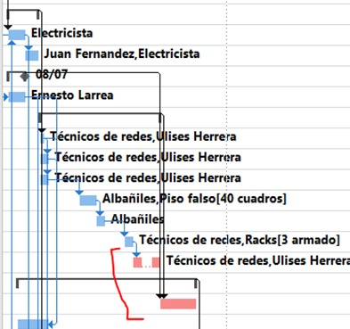
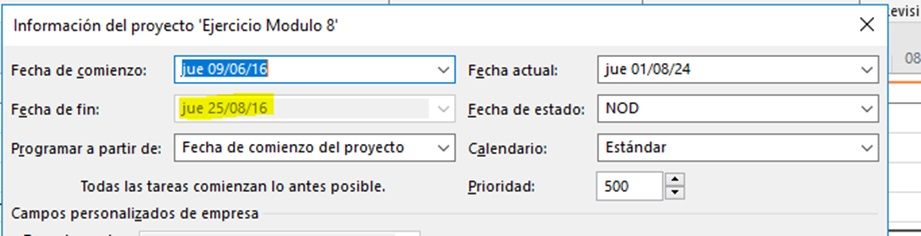

# Práctica 8. Ajustar el cronograma inicial

## Objetivo de la práctica:
Al finalizar la práctica, será capaz de:
- Mostrar holgura de tareas no críticas.
- Observar estadísticas del proyecto.
- Modificar tareas afectadas por evento.
- Evaluar impacto final en la fecha de término.

## Objetivo Visual 

## Duración aproximada:
- 40 minutos.

## Datos de Acceso:
Se envía la IP, usuario y credencial para el acceso al escritorio remoto.

## Instrucciones 
### Tarea. Abrir el archivo de Project titulado “Ejercicio Modulo 8” y realizar las siguientes actividades:
1.	Mostrar de manera gráfica y en la vista adecuada, la holgura de las tareas no críticas.
2.	Observar las estadísticas de proyecto y anotar:
- La fecha de inicio del proyecto_______________
- La fecha de termino del proyecto _____________
3.	Debido a que algunos recursos estarán en capacitación la segunda semana de julio, la tarea 7 “Iluminación” se verá afectada, incrementando su duración en dos días, realizar esta modificación.
4.	Observar las estadísticas de proyecto y anotar:
-	La fecha de inicio del proyecto_______________
-	La fecha de termino del proyecto _____________
5.	¿Afectó la fecha fin del proyecto?
6.	Justificar su respuesta.
7.	En la segunda semana de agosto, se llevará a cabo un evento y afectará la duración de las tareas:  17 “Conectar ruteadores” y 19 “Proceso”. Derivado de lo anterior, las tareas tardarán dos días adicionales. Agregar dos días a cada tarea.
8.	Observar las estadísticas de proyecto y anotar:
-	La fecha de inicio del proyecto_______________
-	La fecha de termino del proyecto _____________
9. ¿Afectó la fecha fin del proyecto?
10.	Justificar su respuesta.

### Resultado esperado

