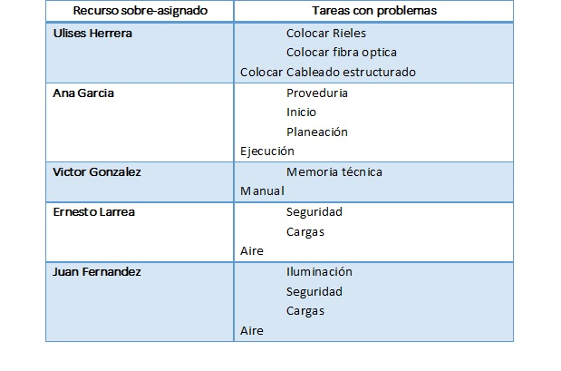
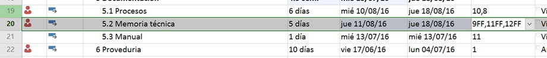

# Ejercicio Capítulo 9

## Objetivo de la práctica:
Al finalizar la práctica, será capaz de:
- Identificar los recursos sobreasignados en la vista de hoja de recursos.
- Identificar tareas con sobreasignación.
- Cambiar la vista a Gantt Detallado.
- Evaluar impacto en sobreasignación.
- Redistribuir el proyecto.

## Objetivo Visual 

## Duración aproximada:
- 40 minutos.

## Datos de Acceso:
Se envía la IP, usuario y credencial para el acceso al escritorio remoto.

## Instrucciones 
<!-- Proporciona pasos detallados sobre cómo configurar y administrar sistemas, implementar soluciones de software, realizar pruebas de seguridad, o cualquier otro escenario práctico relevante para el campo de la tecnología de la información -->
### Tarea. Abra el archivo de Project titulado “Ejercicio Modulo 9” y realice las siguientes actividades:
1.	Abra la vista de hoja de recursos y anote qué recursos estén sobre asignados
2.	Identifique en qué tareas está la sobre asignación. Despliegue dos vistas,  en la parte de arriba abra  la “gráfica de recursos” y en la parte de abajo el “gráfico de Gantt”
3.	Identifique qué recursos están sobre-asignados y cuál es la tarea que tiene el problema
4.	Observe las estadísticas de proyecto y anote:
-	La fecha de inicio del proyecto_______________
-	La fecha de termino del proyecto ____________
5.	Cambie la vista a la vista de Gantt Detallado
6.	Cambie la restricción de la tarea 20 “Memoria técnica” para que empiece lo más tarde posible 
7.	¿Cómo afecta a la sobreasignación de esa tarea?
8.	¿Cómo afecta a la duración de la tarea?
9.	Usando la opción de redistribución, redistribuya el proyecto y observe las modificaciones
-	¿Pudo eliminar toda la sobre asignación?
-	¿Se afectó la fecha fin del proyecto?

### Resultado esperado

